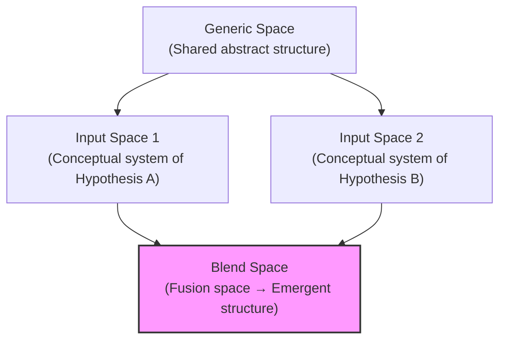
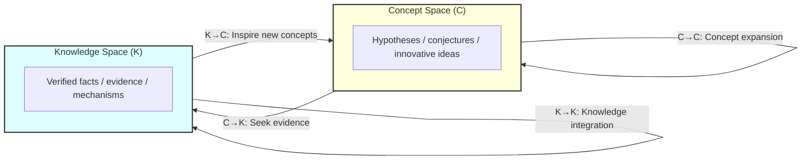
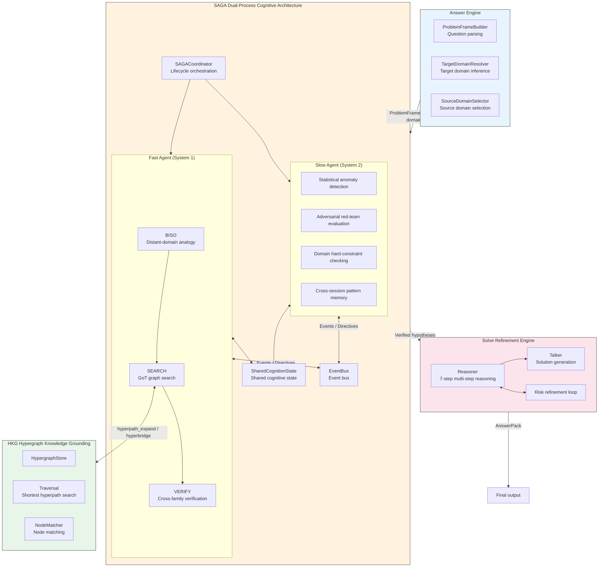
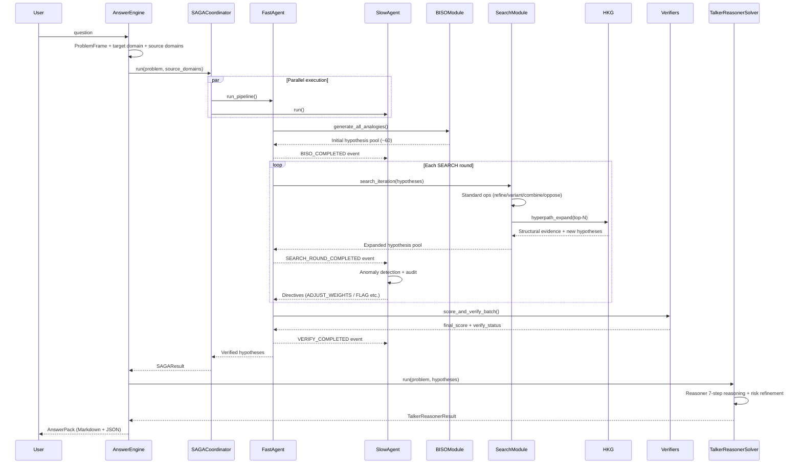
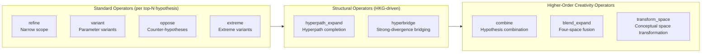
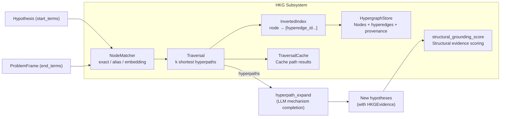
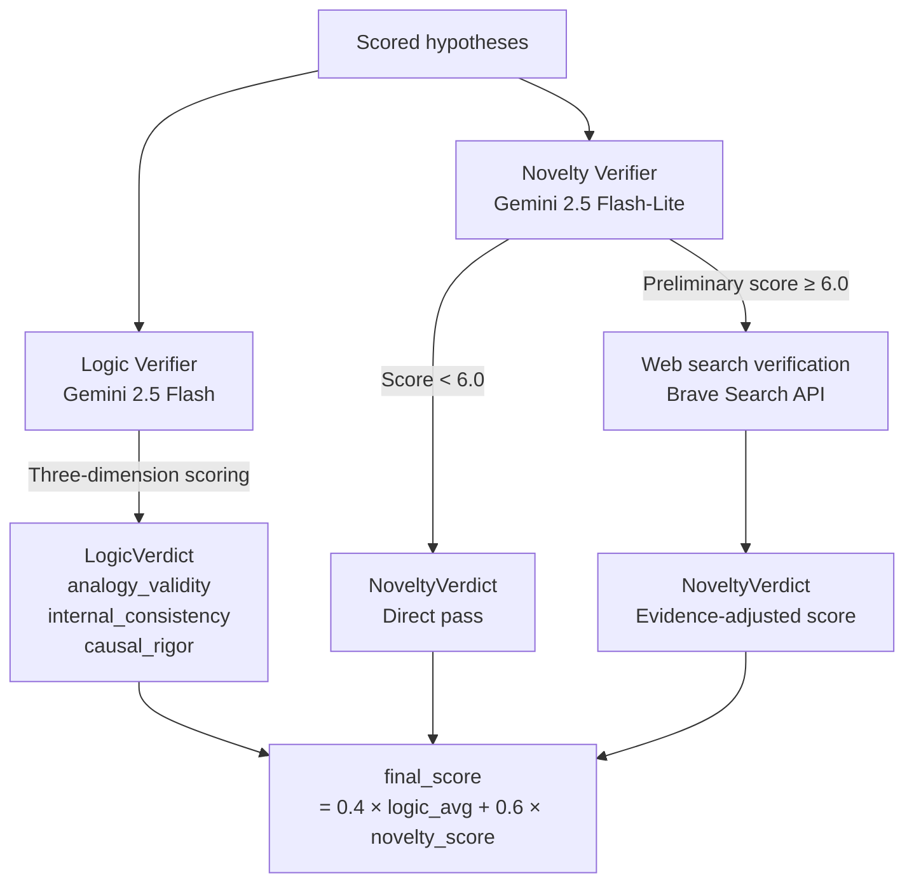
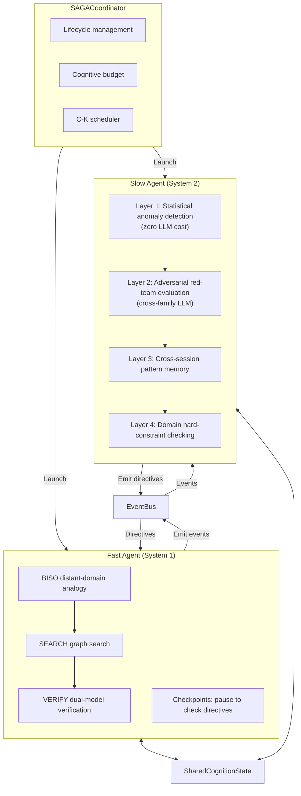
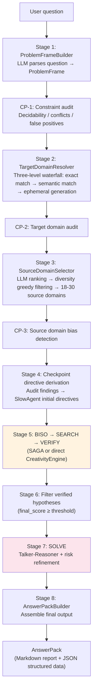

# X-Creative Design Document

This document describes the overall design of the X-Creative system — from theoretical foundations and core pipeline to cognitive supervision architecture and end-to-end orchestration — as a unified design reference.

---

## Table of Contents

1. [Overview](#1-overview)
2. [Theoretical Foundations](#2-theoretical-foundations)
3. [System Architecture Overview](#3-system-architecture-overview)
4. [Core Pipeline: BISO → SEARCH → VERIFY](#4-core-pipeline-biso--search--verify)
5. [SAGA Dual-Process Cognitive Architecture](#5-saga-dual-process-cognitive-architecture)
6. [Solve: Adaptive Risk Refinement](#6-solve-adaptive-risk-refinement)
7. [Answer Engine: End-to-End Orchestration](#7-answer-engine-end-to-end-orchestration)
8. [QD-Pareto and MOME Diversity Preservation](#8-qd-pareto-and-mome-diversity-preservation)
9. [References](#9-references)

---

## 1. Overview

X-Creative is a **structured innovation hypothesis generation and refinement system**. Given a target problem, the system automatically:

1. Discovers structural isomorphisms from distant-domain knowledge and generates cross-domain innovative hypotheses
2. Performs multi-strategy search and expansion across the hypothesis space
3. Filters high-quality hypotheses through cross-model-family verification
4. Outputs actionable solutions through a risk refinement loop

The system's core belief: **Innovation arises from connecting two previously unrelated cognitive frameworks — the greater the semantic distance between domains, the higher the potential innovation value, provided a legitimate structural isomorphism exists between the two domains.**

---

## 2. Theoretical Foundations

X-Creative's design integrates four complementary creativity theories, each with a clear corresponding implementation in the system.

### 2.1 Bisociation

A creativity theory proposed by Arthur Koestler (1964). Core claim:

> **The essence of the creative act is connecting two previously unrelated frames of reference (cognitive matrices).**

Unlike everyday association (linear thinking within a single cognitive framework), bisociation requires thinking to simultaneously operate on two independent "planes of thought" and discover structural isomorphisms between them. For example:

- Archimedes discovering buoyancy in the bathtub — connecting "water level rising during bathing" with "measuring object volume," two unrelated matrices
- Darwin's natural selection — connecting "artificial breeding" with "natural species variation," two separate matrices

Bisociation naturally decomposes into computable steps: a source domain provides transferable structural patterns, a target domain provides the problem space, structural mapping establishes isomorphisms, and operationalization converts abstract mappings into testable variables. This is the theoretical foundation for the BISO stage.

### 2.2 Boden's Three Types of Creativity

Margaret Boden (1998/2004) proposed three categories of creativity:

| Type | Definition | X-Creative Mapping |
|------|------------|-------------------|
| **Combinational** | Combining known ideas in new ways | BISO distant-domain analogy + SEARCH `combine` / `blend_expand` |
| **Exploratory** | Systematically exploring within a known conceptual space | SEARCH `refine` / `variant` / `hyperpath_expand` |
| **Transformational** | Changing the rules of the conceptual space itself | SEARCH `transform_space` |

Transformational creativity is the most radical form of innovation — it doesn't search for new points within an existing framework but changes the framework itself.

### 2.3 Conceptual Blending

The four-space model proposed by Fauconnier & Turner (2002):



Complementary to Bisociation: Bisociation is unidirectional (source → target), while Blending is bidirectional (two input spaces → blend space), producing **emergent structures** — new concepts that don't exist in either input space. In X-Creative, Bisociation handles initial distant-domain analogy, while Blending handles fusing different hypotheses during the SEARCH stage to produce emergent innovation.

### 2.4 C-K Theory (Concept-Knowledge)

The dual-space theory by Hatchuel & Weil (2003/2009):

> **The innovation process is an alternating expansion between the concept space (C, undecidable propositions) and the knowledge space (K, decided propositions).**



The four operators and their X-Creative counterparts:

| Operator | Meaning | X-Creative Implementation |
|----------|---------|--------------------------|
| **C→C** | Intra-concept expansion | SEARCH refine / variant / combine / blend |
| **C→K** | Seeking evidence | VERIFY validation + hyperpath_expand structural evidence |
| **K→C** | New knowledge inspires new concepts | BISO distant-domain analogy + MOME coverage stall trigger |
| **K→K** | Knowledge integration | Reasoner cross-validation + web search |

C-K theory provides the meta-theoretical framework for the entire system — each component is an instance of C-K dual-space operations.

---

## 3. System Architecture Overview

### 3.1 Overall Architecture



### 3.2 Data Flow and Call Relationships

The complete data flow of the system:



### 3.3 Core Component Roles

| Component | Role | Theoretical Basis | Guarantee |
|-----------|------|------------------|-----------|
| **BISO** | Innovation source — generate candidate hypotheses via distant-domain analogy | Bisociation, Combinational creativity | Novelty |
| **SEARCH** | Hypothesis space exploration — multi-strategy expansion with structural grounding | GoT, HKG, Blending, Boden, C-K | Diversity + Depth |
| **VERIFY** | Quality filtering — independent cross-model-family verification | Multi-model cross-validation | Reliability |
| **SAGA** | Metacognitive supervision — detect and correct systematic biases | Dual-process cognitive theory | Process controllability |
| **Solve** | Solution refinement — risk-driven iterative optimization | Talker-Reasoner | Robustness |
| **Answer Engine** | End-to-end orchestration — from question to answer automation | — | Usability |

---

## 4. Core Pipeline: BISO → SEARCH → VERIFY

The core pipeline implements the bisociation process in three stages. Under the SAGA architecture, this pipeline is executed by the Fast Agent and asynchronously monitored by the Slow Agent.

### 4.1 BISO: Distant-Domain Analogy Generation

**Input**: ProblemFrame (problem definition) + source domain library (18–30 curated distant domains)

**Process**: For each source domain (thermodynamics, queuing theory, ecology, game theory, etc.), the system formats its structural patterns and existing mappings into a prompt, requesting the LLM to generate cross-domain analogical hypotheses.

**Example**:

```
Source domain: Thermodynamics → Structure: Law of entropy increase
Target problem: Study the decay mechanism of open-source contributor activity

Generated hypothesis:
  "Repository commit entropy increases over time; when entropy reaches
   a critical point, contributor activity decays — analogous to
   the loss of order caused by energy dissipation in thermodynamic systems"

  Observable variable: commit_entropy = -Σ(p_i × log(p_i))
```

**Key design points**:

- Source domains are processed **in parallel** (`asyncio.Semaphore` for concurrency control)
- Each source domain independently generates N hypotheses (default 3), yielding an initial pool of ~50–60
- Each hypothesis must include:
  - `mapping_table: list[MappingItem]` — structural mapping table
  - `failure_modes: list[FailureMode]` — failure modes
  - `observable` — observable formula / proxy variable
- Source domains undergo **Stage B feasibility filtering**: LLM evaluates each candidate source domain's structural mapping potential with the target problem, filtering out those without mapping feasibility

**Why distant-domain analogy matters**: When researchers always search within their own domain, they get trapped in local optima. Distant-domain analogy provides three breakthroughs: escaping local optima (entirely new perspectives), structural isomorphism (deep pattern transfer across domains), and from analogy to hypothesis (concrete mappings directly produce observable variables).

### 4.2 SEARCH: Structured Search and Expansion

After BISO produces initial hypotheses, SEARCH iteratively expands the hypothesis space through multiple graph operations.

#### 4.2.1 Graph of Thoughts Search

Inspired by Graph of Thoughts [2], SEARCH uses a **graph** rather than a **tree** to organize hypothesis expansion — hypotheses can be combined, opposed, and recombined; two independent paths can converge to produce new hypotheses.

Operator execution order per search round:



| Operator | Description | Creativity Type |
|----------|-------------|-----------------|
| `refine` | Add specific conditions/thresholds, narrow hypothesis scope | Exploratory |
| `variant` | Same structure with different parameters/scenarios | Exploratory |
| `combine` | Combine with other hypotheses | Combinational |
| `oppose` | Generate counter-hypotheses | Exploratory |
| `extreme` | Push parameters to boundary values | Exploratory |
| `hyperpath_expand` | Complete mechanism chains based on shortest hypergraph paths | Exploratory + Structural grounding |
| `hyperbridge` | Force-find structural bridges between distant-domain concepts | Combinational + Structural grounding |
| `blend_expand` | Fauconnier-Turner four-space fusion | Combinational |
| `transform_space` | Boden transformation: change conceptual space rules | Transformational |

**Search algorithm**:

```python
for depth in range(search_depth):
    quota = HeavyQuotaManager(profile, blend_budget, transform_budget, ...)
    topN = select_top_hypotheses(pool)  # Mapping quality gate + Pareto/MOME selection

    for hyp in topN:
        expand(hyp, [refine, variant, combine, oppose])     # Standard ops
        hyperpath_expand(hyp, problem_frame, hkg)            # HKG ops
        if quota.allow("hyperbridge"):
            hyperbridge(hyp, paired_hyp)                     # HKG strong divergence

    if quota.allow("blend_expand"):
        blend_expand(pair_a, pair_b)                         # Conceptual blending
    if quota.allow("transform_space"):
        proposal = transform_space(hyp, concept_space)       # Space transformation
        gate(proposal)  # PROPOSED → ACCEPTED / REJECTED

    pool = pool + new_hypotheses
```

Each round uses selective expansion (not exhaustive), balancing exploration and exploitation.

#### 4.2.2 HKG: Hypergraph Knowledge Grounding

HKG (Hypergraph Knowledge Grounding) is SEARCH's **structural evidence subsystem**, upgrading hypothesis expansion from pure linguistic transformation to "linguistic transformation + structure-evidence-driven."

**Theoretical motivation**: Existing SEARCH operators (refine / variant / combine / oppose) are primarily text-space transformations, lacking an intermediate structural layer capable of expressing "multi-entity joint mechanism units." The engineering patch from MIT's higher-order knowledge representation work [1] is: using hypergraphs to express irreducible multi-entity relationships, and performing constrained path retrieval on them, using paths as mechanism chain skeletons and teacherless guardrails.

**Architecture**:



**`hyperpath_expand` process**:

1. Extract `start_terms` (entities/variables/mechanism names) from the hypothesis
2. Extract `end_terms` (target objects, core outcomes, constraints) from ProblemFrame
3. NodeMatcher maps terms to node sets (two-stage: recall → rerank → confidence chain output)
4. Traversal retrieves K shortest hyperpaths (IS constraint, max_len limit, inverted index local expansion)
5. Assemble structural context package for LLM, generating: mechanism chains, boundary conditions, observables, HyperpathEvidence

**`hyperbridge` (optional)**: Force-finds structurally reachable bridges between two distant-domain concepts, using `IS=1, K>1` traversal, converting paths into candidate bisociation bridges.

**Key constraints**:
- No fabricated evidence on `PATH_NOT_FOUND` (anti-structural-hallucination)
- Provenance text must not be spliced directly into prompts, only references/summaries
- Only invoked for top-N hypotheses per SEARCH round, controlling cost

#### 4.2.3 Conceptual Blending Operator (`blend_expand`)

`blend_expand` implements Fauconnier-Turner four-space fusion (§2.3):

1. Select two hypotheses from the search pool as Input Space 1 and Input Space 2
2. LLM performs four-space fusion reasoning, outputting a `BlendNetwork`:
   - `generic_space`: shared abstract structure
   - `cross_space_mappings`: cross-space projections (identity / compression / elaboration / completion)
   - `emergent_structures`: emergent structures (with `observable_link` and `testable_prediction`)
3. Parsed into new `Hypothesis` objects with `expansion_type="blend"`

#### 4.2.4 Transformational Creativity Operator (`transform_space`)

`transform_space` implements Boden's transformational creativity (§2.2), requiring a `ConceptSpace` defined in the target domain YAML:

```python
class ConceptSpace(BaseModel):
    primitives: list[ConceptSpacePrimitive]        # Basic object/variable types
    relations: list[ConceptSpaceRelation]           # Allowed relation patterns
    hard_constraints: list[ConceptSpaceConstraint]  # Constitutive constraints (inviolable)
    soft_preferences: list[ConceptSpaceConstraint]  # Preference constraints (violable with penalty)
    assumptions_fixed: list[ConceptSpaceAssumption] # Immutable assumptions
    assumptions_mutable: list[ConceptSpaceAssumption]  # Mutable assumptions (transformation targets)
    allowed_ops: list[AllowedTransformOp]           # Allowed transformation operations whitelist
```

Supported transformation operations: `drop_constraint`, `relax_threshold`, `change_representation`, `swap_causal_direction`, `add_new_primitive`, `merge_primitives`, `split_process`, `negate_assumption`.

Transformation outputs must pass through the **Transform Gate** (mandatory C→K verification):

1. Generation stage uniformly produces `PROPOSED`
2. Gate runs Logic Verifier validation + op whitelist / fixed assumption protection audit
3. `ACCEPTED` enters the main search pool; `REJECTED` retains only audit records

#### 4.2.5 Runtime Profiles and Heavy Operator Quotas

To control combinatorial explosion and latency:

| Profile | Behavior | Goal |
|---------|----------|------|
| `interactive` | Disable heavy operators (`hyperbridge` / `blend_expand` / `transform_space`) | Low-latency interaction |
| `research` | Allow heavy operators, subject to quota constraints | Deep exploration |

When quotas are exhausted, the system automatically degrades to `refine` / `variant`, ensuring search continues and costs remain controlled.

#### 4.2.6 Structural Mapping Quality Gate

The quality of structural mappings is central to bisociation. The system elevates it to a first-class concern.

**MappingScorer two-layer evaluation**:

**Rule layer (zero LLM cost, anti-padding)**:

| Check | Requirement | Meaning |
|-------|-------------|---------|
| Effective rows | `effective_rows >= 6` | Counted by new information increment, not raw row count |
| Relation completeness | Each row has `source_relation` and `target_relation` | Entity-only matches disallowed |
| Duplication rate | `duplicate_ratio <= 0.3` | Suppress padding / template stacking |
| Row usage coverage | `row_usage_coverage >= 0.7` | Mapping rows must be used by downstream artifacts |
| Type coverage | `mapping_type` covers >= 2 types | Cover different mapping levels |
| Systematicity groups | At least 1 group with >= 3 effective mappings | Prove coherent relational systems exist |
| `observable_link` mandatory | Effective rows must provide it | Traceability is required |

Hypotheses failing the rule layer are capped at a score of 4.0.

**LLM layer (invoked only after rules pass)**: Evaluates the systematicity and depth of mappings — are higher-order relations (feedback loops, causal chains, constraint conditions) mapped?

**Mapping Unpack Audit**: Randomly samples 2 effective rows, requiring explanation of how they support observables or failure_modes. Unexplainable rows trigger a `MAPPING_PADDING_SUSPECTED` event and discount the mapping_score.

**SEARCH mapping quality gate**: Hypotheses with mapping quality scores below threshold are excluded from top-N expansion selection — poorly mapped hypotheses are pruned from the search tree.

### 4.3 VERIFY: Multi-Layer Verification

Single-model scoring has a fundamental flaw: the same LLM both generates and judges, easily leading to reward hacking. VERIFY mitigates this through multiple layers.

#### 4.3.1 Cross-Model-Family Dual Verifiers



**Logic Verifier**: Evaluates analogy validity, internal consistency, and causal rigor across three dimensions (0-10), requiring all three ≥ 6.0 to pass.

**Novelty Verifier**: Two-stage process — LLM preliminary screening → web search verification (Brave Search, 3 concurrent rounds: concept 0.3 + implementation 0.5 + cross_domain 0.2).

**Cross-model-family strategy** core logic: Generation and verification models use different model families, exploiting asymmetries in model biases. If a hypothesis scores high on the primary model but fails cross-family verification, it's likely exploiting that specific model's preferences.

#### 4.3.2 Five-Dimension Composite Score

Used for hypothesis ranking and selective expansion during BISO / SEARCH:

| Dimension | Measures | Weight |
|-----------|----------|--------|
| Divergence | Semantic distance from known methods | 0.21 |
| Testability | Can it be converted to testable signals | 0.26 |
| Rationale | Do causal mechanisms hold | 0.21 |
| Robustness | Overfitting risk | 0.17 |
| Feasibility | Data availability | 0.15 |

Two independent scoring tracks: `composite_score` (five-dimension weighted sum, for search selection) and `final_score` (cross-model-family verification, for final ranking). When HKG is enabled, `structural_grounding_score` (0-10) can be added as an optional dimension.

#### 4.3.3 Confidence Enhancement

**Multi-sample confidence estimation**: Run k=3 independent scoring rounds on the same hypothesis, `variance_confidence = exp(-0.5 × avg_std)`.

**Position bias defense**: Forward + reversed evaluations; inconsistency multiplies confidence by a 0.7 decay factor.

**VerifyStatus enum**:

| Status | Meaning |
|--------|---------|
| PASSED | Hypothesis passed verification |
| FAILED | Hypothesis failed verification |
| ESCALATED | Insufficient confidence, escalated for handling |
| ABSTAINED | Verifier cannot reliably assess, abstains |

**Prompt injection scanning**: Regex pre-filtering before VERIFY scoring (`ignore previous instructions`, `override system prompt`, etc.). Detected injections emit a `VERIFY_INJECTION_DETECTED` event.

---

## 5. SAGA Dual-Process Cognitive Architecture

### 5.1 Theoretical Foundation

SAGA (Slow Agent and fast aGent Architecture) is inspired by Kahneman's dual-process theory: System 1 (fast thinking, high throughput but susceptible to heuristic biases) and System 2 (slow thinking, low throughput but with metacognitive capabilities).

Core insight: **The BISO → SEARCH → VERIFY pipeline is essentially System 1 — efficient but easily blinded by its own biases. The system needs a System 2 to continuously supervise System 1's behavioral patterns.**

### 5.2 Fast Agent and Slow Agent



**Fast Agent**: An event-aware wrapper around the BISO → SEARCH → VERIFY pipeline. It **does not wait** for Slow Agent's analysis results, continuously executing forward, only briefly pausing at checkpoints to check for directives.

**Slow Agent**: A metacognitive overseer that does not regenerate hypotheses but monitors Fast Agent's **behavioral patterns**.

### 5.3 Events and Directive System

#### Events Emitted by Fast Agent

| Stage | Event | Trigger |
|-------|-------|---------|
| BISO | `BISO_COMPLETED` | A batch of hypotheses finished generating |
| SEARCH | `SEARCH_ROUND_COMPLETED` | One search expansion round completed |
| VERIFY | `VERIFY_BATCH_SCORED` | A batch of hypotheses scored |
| HKG | `HKG_PATH_FOUND` / `HKG_PATH_NOT_FOUND` | Hypergraph retrieval results |
| Mapping | `MAPPING_PADDING_SUSPECTED` | Mapping table may contain padding |
| VERIFY | `VERIFY_POSITION_INCONSISTENT` | Position bias detected |
| VERIFY | `VERIFY_INJECTION_DETECTED` | Prompt injection detected |
| Creativity | `BLEND_EXPAND_COMPLETED` | Blending operation completed |
| Creativity | `TRANSFORM_PROPOSED` / `TRANSFORM_ACCEPTED_OR_REJECTED` | Transformation operation lifecycle |
| Constraints | `CONSTRAINT_VIOLATION_FOUND` / `CONSTRAINT_PATCH_APPLIED` | Constraint audit and patching |

#### Directives Emitted by Slow Agent

| Directive | Effect |
|-----------|--------|
| `ADJUST_WEIGHTS` | Dynamically modify scoring weights |
| `ADJUST_SEARCH_PARAMS` | Change search strategy |
| `INJECT_CHALLENGE` | Inject red-team challenge |
| `PAUSE_PIPELINE` / `RESUME_PIPELINE` | Pause/resume pipeline |
| `FLAG_HYPOTHESIS` | Flag specific hypothesis for review |
| `ADD_CONSTRAINT` | Dynamically append constraint |

#### Slow Agent's Four Defense Layers

**Layer 1: Statistical anomaly detection (zero LLM cost, triggered per event batch)**

| Detection | Anomaly Signal | Meaning |
|-----------|---------------|---------|
| Score compression | `std(scores) < 0.8` | Model producing "safe" medium scores |
| Dimension collinearity | Correlation > 0.7 | Scorer effectively using only one hidden dimension |
| Source domain bias | Significant ANOVA difference | Some domains systematically score higher |
| Shallow rewrite | Small edit distance but large score difference | Surface rewrites gaming scores |

**Layer 2: Adversarial red-team evaluation (checkpoints only, targeting top-N hypotheses)**

Uses a **different model family than Fast Agent**. Challenge types include: counterexample construction, simplification test, causal reversal, operationalizability verification.

**Layer 3: Cross-session pattern memory**

Tracks hypothesis patterns across sessions via semantic hashing. Mappings that repeatedly appear and score highly are flagged as "LLM favorite patterns."

**Layer 4: Domain hard-constraint checking**

Based on constraints defined in TargetDomainPlugin — Critical constraints as hard thresholds (violation = rejection), anti-pattern matching, stale ideas distance calculation.

### 5.4 Cognitive Budget

Unlimited auditing leads to cost explosion. The cognitive budget simulates human attention selectivity — System 2 focuses its energy where it matters most.

```
Total budget: 100 units (1 unit ≈ 1 standard LLM call)

Emergency reserve:    10%
Domain audit:          9%
BISO monitoring:     13.5%
SEARCH monitoring:   13.5%
VERIFY monitoring:    18%
Adversarial eval:    22.5%  ← Most expensive but most effective
Global review:       13.5%
```

Four allocation strategies: `ANOMALY_DRIVEN` (default, anomalous hypotheses 3 units), `ATTENTION_WEIGHTED` (more budget for high-scoring hypotheses), `NOVELTY_GATED` (only audit hypotheses with novelty ≥ 7.0), `UNIFORM` (equal allocation).

### 5.5 C-K Coordinator

`CKCoordinator` is embedded within `SAGACoordinator`, explicitly managing the expansion rhythm of C-K dual spaces:

- **C→K transition** triggers: `evidence_gap` (hypothesis lacks evidence), `non_operationalizable` (concept cannot be operationalized)
- **K→C transition** triggers: `new_mechanism` (new mechanism discovered), `new_evidence` (new evidence), `structure_found` (new HKG path)

Anti-oscillation mechanism: minimum phase duration `min_phase_duration_s = 10.0` prevents rapid C-K oscillation. K-space expansion budget `max_k_expansion_per_session = 5` prevents K expansion from consuming too much.

Synergy with MOME: MOME `coverage_ratio` stalls → triggers `coverage_plateau` → transitions to Knowledge Expansion → searches for new evidence → new concepts fill blank regions.

---

## 6. Solve: Adaptive Risk Refinement

### 6.1 Problem

Single-pass solving has inherent flaws: blind spot risk (initial solutions miss risks only exposed by adversarial review), suboptimal solutions (solutions violate implicit constraints), and insight waste (risk analysis output gets discarded).

### 6.2 Talker-Reasoner Architecture

The refinement loop runs on the Talker-Reasoner architecture (inspired by DeepMind research):

- **Reasoner (System 2)**: Executes 7-step multi-step reasoning, constructing a structured BeliefState
- **Talker (System 1)**: Generates detailed actionable solutions based on the final BeliefState

```mermaid
graph LR
    subgraph Reasoner["Reasoner 7-Step Reasoning"]
        S1["① Problem analysis"]
        S2["② Hypothesis evaluation"]
        S3["③ Evidence gathering"]
        S4["④ Cross-validation"]
        S5["⑤ Solution planning"]
        S6["⑥ Quality audit"]
        S7["⑦ Belief synthesis"]
        S1 --> S2 --> S3 --> S4 --> S5
        S5 <-->|"Inner loop<br/>High risk → Re-plan"| S6
        S6 --> S7
    end

    S7 -->|"BeliefState"| T["Talker<br/>Generate actionable solution"]
    T --> OUT["solution_markdown"]

    style S5 fill:#ffe0b2
    style S6 fill:#ffe0b2
```



### 6.3 Dual-Loop Structure

#### Inner Loop: Step 5 ↔ Step 6 Iteration

```python
for round in range(1, inner_max + 1):
    solution_blueprint = reasoner.step_5_plan(prior_risks)  # Inject prior high-risk items
    quality_assessment = reasoner.step_6_audit(solution_blueprint)
    high_risks = [r for r in quality_assessment.risks if r.severity == "high"]
    if not high_risks:
        break  # Converged
    prior_risks = high_risks  # Feedback to next round
```

#### Outer Loop: Constraint Escalation

When the inner loop fails to converge, unresolved risks are converted into problem constraints, and Solve is re-run.

```python
for outer_round in range(1, outer_max + 1):
    result = run_solve_once(constraints=current_constraints, inner_max=inner_max)
    high_risks = extract_high_risks(result)
    if not high_risks:
        return result  # Global convergence
    new_constraints = risks_to_constraints(high_risks)  # Semantic deduplication
    current_constraints.extend(new_constraints)
```

### 6.4 Constraint Management

#### ConstraintSpec: Structured Constraints

| Field | Description |
|-------|-------------|
| `text` | Constraint description |
| `priority` | critical / high / medium / low |
| `type` | hard (violation = rejection) / soft (violation = penalty) |
| `origin` | user / domain_plugin / risk_refinement |
| `weight` | Importance weight (0-1) |

#### ConstraintCompiler: Constraint Compilation and Active Sets

Constraints are compiled into two tiers before entering prompts:

1. **HardCore**: Inviolable constraints, always injected, repeated at prompt beginning + end (anti-mid-section forgetting)
2. **ActiveSoftSet**: 3–6 soft constraints selected by round-relevance for activation

`max_constraints=15` represents the **constraint library cap**, not the per-prompt injection count. User constraints (`origin=user`) are always preserved and never pruned.

#### Constraint Inflation Protection

- **Repeated risk detection**: Adjacent-round risk text similarity > 0.6 triggers `CONSTRAINT_REFRAME_TRIGGERED`, requiring constraint restructuring rather than appending
- **Constraint conflict detection**: Contradictory constraints trigger `CONSTRAINT_CONFLICT_DETECTED`
- **User constraint preflight**: Normalization + deduplication → conflict detection → irreconcilable conflicts exit immediately prompting correction
- **Constraint Audit & Patch Loop**: Audit whether high-risk items are covered by constraints → uncovered items generate patch constraints → budget pruning → next round

#### User Hard-Constraint Compliance Audit

After Talker generates a solution, each user constraint is audited individually. Violations trigger up to 2 revision rounds. If still unsatisfied, the system exits with a full violation report (rather than returning a constraint-violating result).

### 6.5 Convergence Conditions

| Condition | Meaning |
|-----------|---------|
| Zero high-risk items | Ideal convergence |
| `inner_max` exhausted | Inner iteration limit reached |
| `outer_max` exhausted | Outer iteration limit reached |
| Cannot generate new constraints | Risks cannot be converted to actionable constraints |

When convergence is incomplete, the current best result is returned with the count of unresolved high-risk items.

---

## 7. Answer Engine: End-to-End Orchestration

### 7.1 Why an Answer Engine

Before the Answer Engine, users had to manually execute multiple steps: create session → define problem → select target domain → run BISO → SEARCH → VERIFY → SOLVE. The Answer Engine simplifies this to: **input a natural language question, automatically output answer + traceable evidence + risk boundaries.**

### 7.2 Eight-Stage Execution Flow



### 7.3 SAGA Checkpoints

The Answer Engine sets up SAGA checkpoints between pipeline stages:

| Checkpoint | Position | Audit Content |
|------------|----------|---------------|
| CP-1 | After ProblemFrame construction | Constraint decidability / conflicts / false positives |
| CP-2 | After target domain determined | Domain selection reasonableness |
| CP-3 | After source domain selection | Source domain bias detection |
| CP-4 | After BISO completion | Score compression / diversity collapse |
| CP-5 | After each SEARCH round | Structural collapse / shallow rewrite |
| CP-6 | After VERIFY completion | Dimension collinearity / reward hacking |
| CP-7 | After each SOLVE round | Risk convergence / pattern memory |

CP-1/2/3 are newly added by Answer Engine (synchronous inter-stage calls); CP-4 through CP-7 are implemented by SAGACoordinator via the FastAgent event system.

### 7.4 HKG Participation Points in the Full Pipeline

1. **SEARCH**: `hyperpath_expand` invokes shortest hyperpath retrieval for top-N hypotheses to complete mechanism chains; `hyperbridge` finds structural bridges between distant-domain concepts
2. **VERIFY**: `structural_grounding_score` penalizes hypotheses lacking structural evidence chains
3. **SAGA monitoring**: HKG events are used by Slow Agent to detect structural hallucinations (e.g., PATH_NOT_FOUND but hypothesis claims structural evidence)

### 7.5 Design Principles

1. **No modification of existing modules**: Answer Engine only imports existing components; all new logic resides in the `x_creative/answer/` package
2. **Progressive enhancement**: Each component is independently testable; failures are handled gracefully (e.g., target domain inference failure falls back to "general")
3. **Traceability**: Each stage's artifacts are saved to the session directory; AnswerPack JSON contains complete metadata

---

## 8. QD-Pareto and MOME Diversity Preservation

### 8.1 Problem

The original `composite_score` (5-dimension linear weighted sum) has fundamental issues:

- A single set of linear weights cannot discover points on non-convex Pareto fronts
- The system tends to select "safe" hypotheses with high Feasibility but low Novelty
- Similarly ranked hypotheses may be very close in the objective space, lacking diversity

### 8.2 NSGA-II Pareto Selection

Selection is replaced from single-axis ranking to two-axis Pareto selection:

- **Novelty axis** = `divergence`
- **Feasibility axis** = `(testability + rationale + robustness + feasibility) / 4`

NSGA-II steps: non-dominated sorting (F₀, F₁, F₂...) → crowding distance calculation → select by (rank↑, crowding_distance↓).

Novelty-conditional dynamic weight: `wN = wn_min + (wn_max - wn_min) × (1-n)^γ`. High-Novelty hypotheses are pushed toward feasibility; low-Novelty hypotheses are pushed toward more innovation.

### 8.3 MOME (Multi-Objective MAP-Elites)

MOME combines Pareto selection with MAP-Elites grids:

> **Each behavioral region (grid cell) maintains its own Pareto front; selection prioritizes sampling from sparse regions.**

**BehaviorDescriptor**: Each hypothesis's behavioral descriptor (`mechanism_family` + `data_granularity`) is extracted and mapped to MAP-Elites grid coordinates.

**MOMECell**: Each cell maintains a capacity-limited Pareto front; hypotheses from different behavioral regions don't compete with each other.

**Sparse-cell-first selection**: The least-explored behavioral regions are prioritized for expansion seeds, maximizing behavioral coverage.

`coverage_ratio = filled_cells / total_cells` serves as a signal for triggering Knowledge Expansion in C-K theory (§5.5).

**Feature flags**:

```python
pareto_selection_enabled: bool = False  # Base Pareto selection
mome_enabled: bool = False              # MOME upgrade (requires pareto=True)
```

---

## 9. References

1. Higher-Order Knowledge Representations for Agentic Scientific Reasoning. https://arxiv.org/html/2601.04878v1
2. Baumgärtner, T., et al. (2023). Graph of Thoughts: Solving Elaborate Problems with Large Language Models. https://arxiv.org/abs/2308.09687
3. MIT Open Source Implementation (HyperGraphReasoning). https://github.com/lamm-mit/HyperGraphReasoning
4. HyperNetX Documentation. https://hypernetx.readthedocs.io/
5. HuggingFace Dataset (HyperGraphReasoning). https://huggingface.co/datasets/lamm-mit/HyperGraphReasoning
6. Koestler, A. (1964). *The Act of Creation*. Hutchinson.
7. Fauconnier, G., & Turner, M. (2002). *The Way We Think: Conceptual Blending and the Mind's Hidden Complexities*. Basic Books.
8. Boden, M. A. (2004). *The Creative Mind: Myths and Mechanisms* (2nd ed.). Routledge.
9. Hatchuel, A., & Weil, B. (2009). C-K design theory: an advanced formulation. *Research in Engineering Design*, 19(4), 181-192.
10. Deb, K., et al. (2002). A fast and elitist multiobjective genetic algorithm: NSGA-II. *IEEE Transactions on Evolutionary Computation*, 6(2), 182-197.
11. Lim, B., Flageat, M., & Cully, A. (2023). Multi-Objective MAP-Elites (MOME). In *Proceedings of GECCO*.
