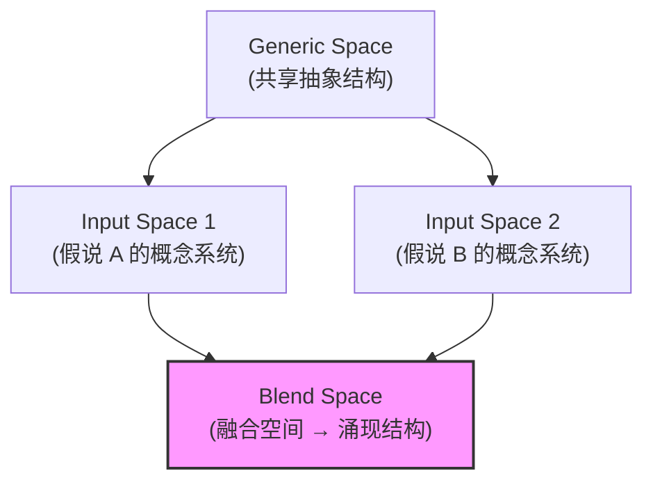
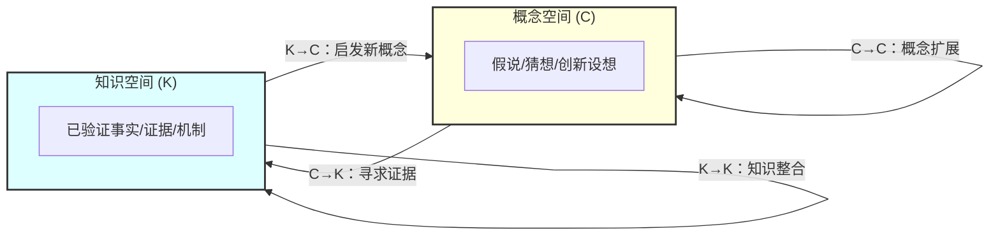
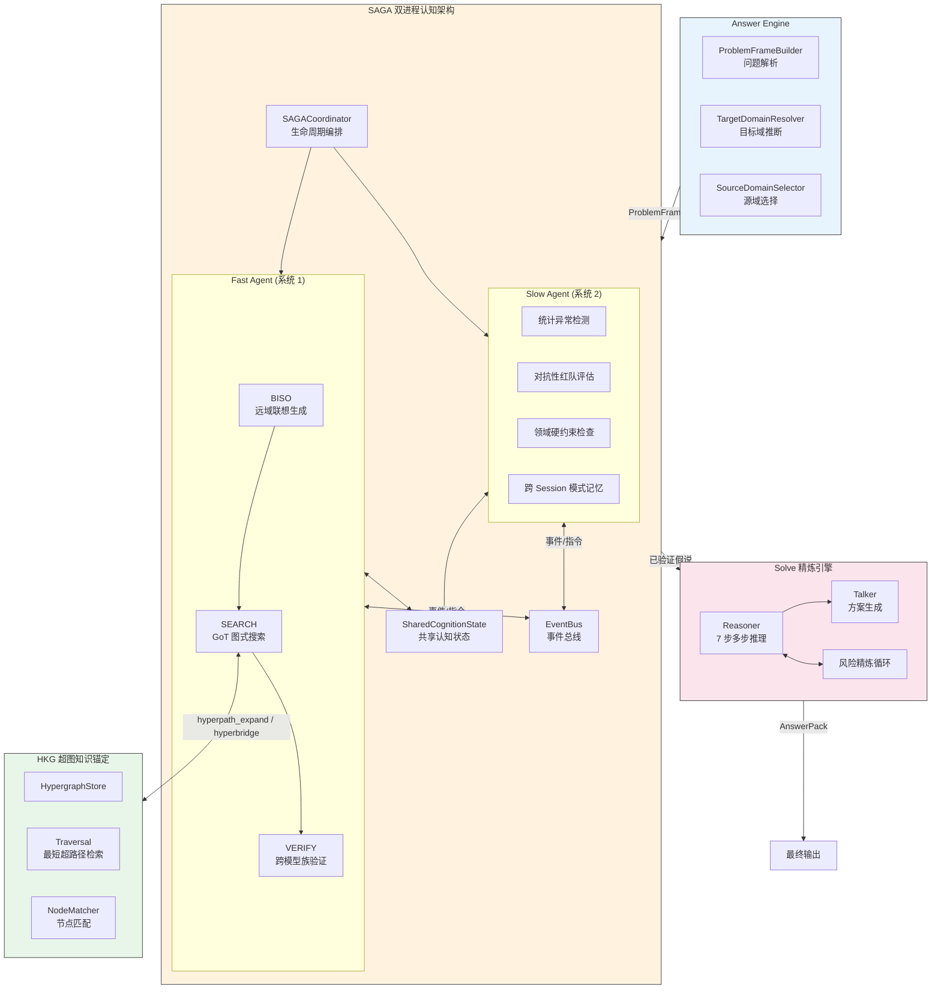
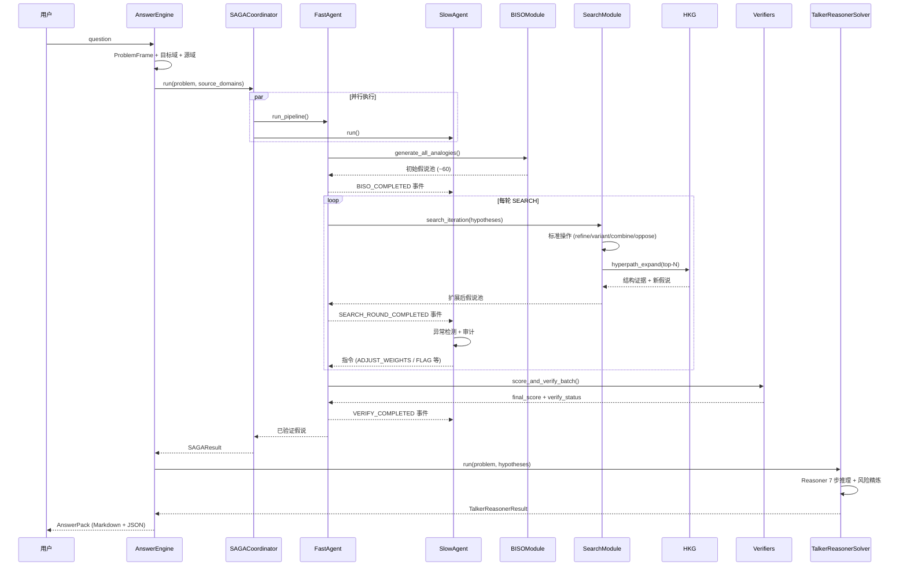
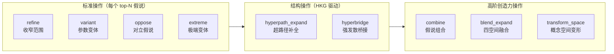
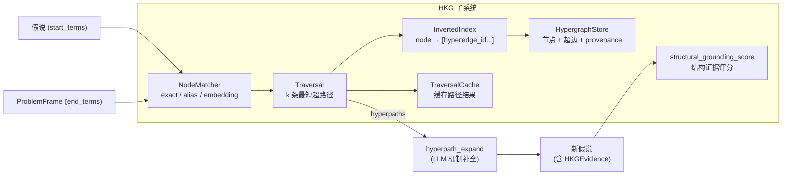
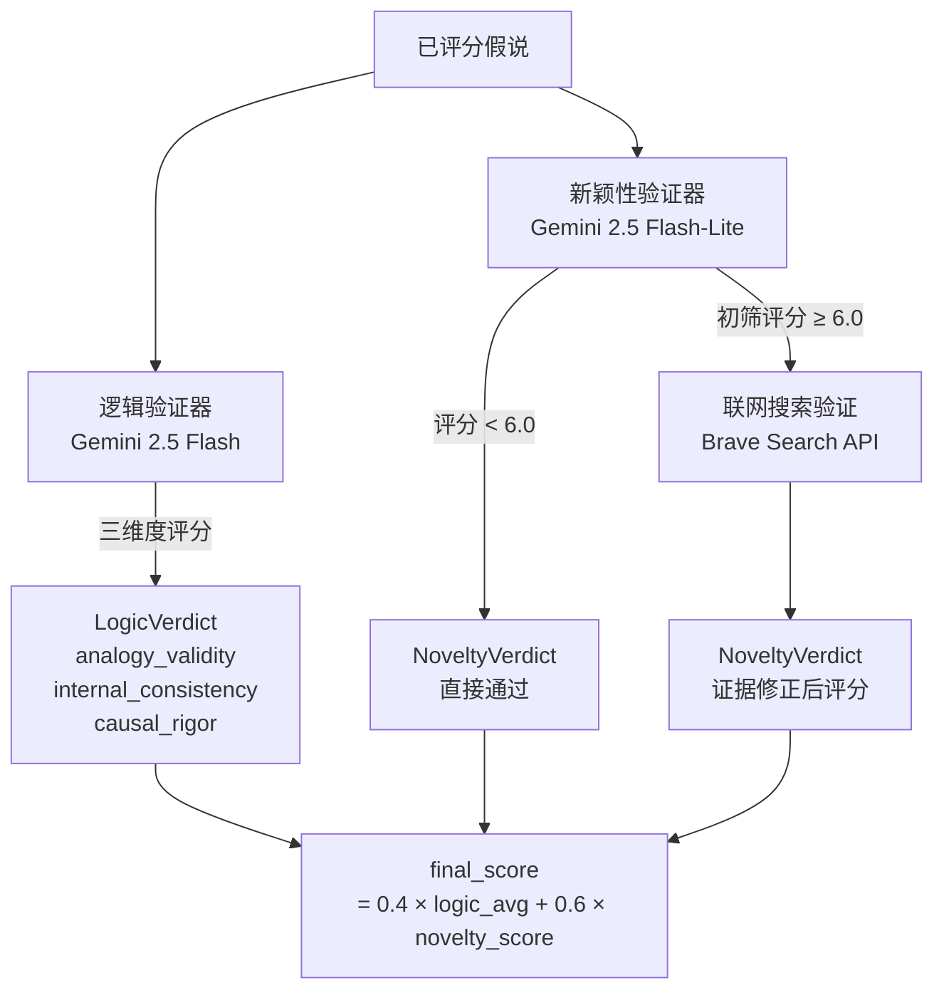
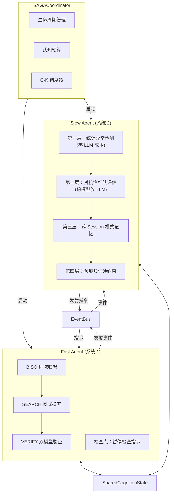
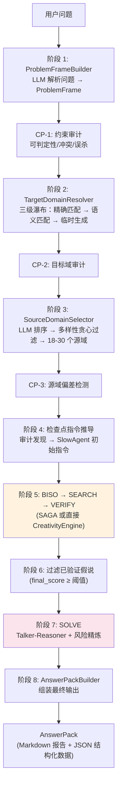

# X-Creative 设计文档

本文档阐述 X-Creative 系统的整体设计——从理论基础、核心流水线、认知监督架构到全链路编排——作为一份统一的设计参考。

---

## 目录

1. [概述](#1-概述)
2. [理论基础](#2-理论基础)
3. [系统架构总览](#3-系统架构总览)
4. [核心流水线：BISO → SEARCH → VERIFY](#4-核心流水线biso--search--verify)
5. [SAGA 双进程认知架构](#5-saga-双进程认知架构)
6. [Solve：自适应风险精炼](#6-solve自适应风险精炼)
7. [Answer Engine：全链路编排](#7-answer-engine全链路编排)
8. [QD-Pareto 与 MOME 多样性保持](#8-qd-pareto-与-mome-多样性保持)
9. [参考文献](#9-参考文献)

---

## 1. 概述

X-Creative 是一个**结构化创新假说生成与精炼系统**。给定一个目标问题，系统自动完成：

1. 从远域知识中发现结构同构，生成跨领域创新假说
2. 在假说空间中进行多策略搜索与扩展
3. 通过跨模型族验证筛选高质量假说
4. 经过风险精炼循环输出可执行方案

系统的核心信念是：**创新来自于将两个此前毫不相关的认知框架连接起来——领域间的语义距离越远，潜在的创新价值越高，前提是两个领域之间存在合法的结构性同构。**

---

## 2. 理论基础

X-Creative 的设计融合了四个互补的创造力理论，每个理论在系统中有明确的对应实现。

### 2.1 Bisociation（双联想）

Arthur Koestler (1964) 提出的创造力理论。核心主张：

> **创造性行为的本质，是将两个此前毫不相关的认知矩阵（frames of reference）连接起来。**

与日常联想（在单一认知框架内的线性思维）不同，bisociation 要求思维同时运行在两个独立的"思维平面"上，并在它们之间发现结构性的同构关系。例如：

- 阿基米德在浴缸中发现浮力定律——将"洗澡时水位上升"与"物体体积度量"两个无关矩阵连接
- 达尔文的自然选择——将"人工育种"与"自然界物种变异"两个矩阵连接

Bisociation 天然适合被分解为可计算的步骤：源领域提供可迁移的结构模式，目标领域提供问题空间，结构映射建立同构关系，可观测化将抽象映射转化为可测试的变量。这是 BISO 阶段的理论基础。

### 2.2 Boden 三类创造力

Margaret Boden (1998/2004) 提出三种创造力分类：

| 类型 | 定义 | X-Creative 对应 |
|------|------|-----------------|
| **组合创造力** | 将已知想法以新方式组合 | BISO 远域联想 + SEARCH 的 `combine` / `blend_expand` |
| **探索性创造力** | 在已知概念空间中系统性探索 | SEARCH 的 `refine` / `variant` / `hyperpath_expand` |
| **变形创造力** | 改变概念空间本身的规则 | SEARCH 的 `transform_space` |

变形创造力是最激进的创新形式——不是在现有框架内寻找新点，而是改变框架本身。

### 2.3 概念融合（Conceptual Blending）

Fauconnier & Turner (2002) 提出的四空间模型：



与 Bisociation 互补：Bisociation 是单向的（源→目标），Blending 是双向的（两个输入空间→融合空间），且产出 **涌现结构**——融合空间中任何输入空间都不存在的新概念。在 X-Creative 中，Bisociation 负责初始远域联想，Blending 负责在 SEARCH 阶段将不同假说融合产生涌现创新。

### 2.4 C-K 理论（Concept-Knowledge）

Hatchuel & Weil (2003/2009) 的双空间理论：

> **创新过程是概念空间（C，不可判定命题）和知识空间（K，已判定命题）之间的交替扩展。**



四个操作算子在 X-Creative 中的对应：

| 算子 | 含义 | X-Creative 实现 |
|------|------|----------------|
| **C→C** | 概念内扩展 | SEARCH 的 refine / variant / combine / blend |
| **C→K** | 寻求证据 | VERIFY 验证 + hyperpath_expand 结构证据 |
| **K→C** | 新知识启发新概念 | BISO 远域联想 + MOME coverage 停滞触发 |
| **K→K** | 知识整合 | Reasoner 交叉验证 + 联网搜索 |

C-K 理论为整个系统提供了元理论框架——每个组件都是 C-K 双空间操作的实例。

---

## 3. 系统架构总览

### 3.1 整体架构



### 3.2 数据流与调用关系

系统的完整数据流如下：



### 3.3 核心组件的角色定位

| 组件 | 角色 | 理论基础 | 保障目标 |
|------|------|---------|---------|
| **BISO** | 创新源泉——通过远域联想生成候选假说 | Bisociation, 组合创造力 | 创新性 |
| **SEARCH** | 假说空间探索——多策略扩展与结构锚定 | GoT, HKG, Blending, Boden, C-K | 多样性 + 深度 |
| **VERIFY** | 质量筛选——跨模型族独立验证 | 多模型交叉验证 | 可靠性 |
| **SAGA** | 元认知监督——检测并纠正系统性偏差 | 双进程认知理论 | 过程可控性 |
| **Solve** | 方案精炼——风险驱动的迭代优化 | Talker-Reasoner | 稳健性 |
| **Answer Engine** | 全链路编排——从问题到答案的自动化 | — | 易用性 |

---

## 4. 核心流水线：BISO → SEARCH → VERIFY

核心流水线将 bisociation 过程实现为三个阶段。在 SAGA 架构中，这条流水线由 Fast Agent 执行，并受 Slow Agent 的异步监控。

### 4.1 BISO：远域联想生成

**输入**：ProblemFrame（问题定义）+ 源领域库（18～30 个精选远域）

**过程**：对每个源领域（热力学、排队论、生态学、博弈论等），将其结构模式及已有映射格式化为 prompt，要求 LLM 生成跨领域类比假说。

**示例**：

```
源领域: 热力学 → 结构: 熵增定律
目标问题: 研究开源项目贡献者活跃度的衰减机制

生成的假说:
  "代码仓库的提交熵随时间增加，当熵达到临界点时，
   贡献者活跃度衰减——类比热力学系统中能量耗散导致的有序性丧失"

  可观测变量: commit_entropy = -Σ(p_i × log(p_i))
```

**设计要点**：

- 各源领域**并行处理**（`asyncio.Semaphore` 控制并发）
- 每个源领域独立生成 N 个假说（默认 3 个），初始池约 50-60 个
- 每个假说必须包含：
  - `mapping_table: list[MappingItem]` — 结构映射表
  - `failure_modes: list[FailureMode]` — 失效模式
  - `observable` — 可观测公式/代理变量
- 源领域经过 **Stage B 可行性过滤**：LLM 评估候选源域与目标问题的结构映射潜力，过滤无映射可行性的源域

**为什么需要远域联想**：当研究者始终在自己的领域内搜索，会陷入局部最优。远域联想提供三种突破：逃脱局部最优（提供全新视角）、结构同构性（跨领域的深层模式迁移）、从类比到假说（类比的具体映射直接产生可观测变量）。

### 4.2 SEARCH：结构化搜索与扩展

BISO 产出初始假说后，SEARCH 通过多种图操作迭代扩展假说空间。

#### 4.2.1 Graph of Thoughts 图式搜索

受 Graph of Thoughts [2] 启发，SEARCH 使用**图**而非**树**来组织假说扩展——假说可以被组合、对立、重组合，两条独立路径可以交汇产生新假说。

每轮搜索的操作执行顺序：



| 操作 | 说明 | 创造力类型 |
|------|------|-----------|
| `refine` | 增加具体条件/阈值，收窄假说范围 | 探索性 |
| `variant` | 相同结构但不同参数/场景 | 探索性 |
| `combine` | 与其他假说组合 | 组合性 |
| `oppose` | 生成对立假说 | 探索性 |
| `extreme` | 将参数推到边界值 | 探索性 |
| `hyperpath_expand` | 基于超图最短路径补全机制链 | 探索性 + 结构锚定 |
| `hyperbridge` | 在远域概念间强制寻找结构桥梁 | 组合性 + 结构锚定 |
| `blend_expand` | Fauconnier-Turner 四空间融合 | 组合性 |
| `transform_space` | Boden 变形：改变概念空间规则 | 变形性 |

**搜索算法**：

```python
for depth in range(search_depth):
    quota = HeavyQuotaManager(profile, blend_budget, transform_budget, ...)
    topN = select_top_hypotheses(pool)  # 映射质量门 + Pareto/MOME 选择

    for hyp in topN:
        expand(hyp, [refine, variant, combine, oppose])     # 标准操作
        hyperpath_expand(hyp, problem_frame, hkg)            # HKG 操作
        if quota.allow("hyperbridge"):
            hyperbridge(hyp, paired_hyp)                     # HKG 强发散

    if quota.allow("blend_expand"):
        blend_expand(pair_a, pair_b)                         # 概念融合
    if quota.allow("transform_space"):
        proposal = transform_space(hyp, concept_space)       # 空间变形
        gate(proposal)  # PROPOSED → ACCEPTED / REJECTED

    pool = pool + new_hypotheses
```

每轮选择性扩展（非穷举），在探索与利用之间取得平衡。

#### 4.2.2 HKG：超图知识锚定

HKG（Hypergraph Knowledge Grounding）是 SEARCH 的**结构证据子系统**，将假说扩展从纯语言变换升级为"语言变换 + 结构证据驱动"。

**理论动机**：现有 SEARCH 操作（refine / variant / combine / oppose）以文本空间变换为主，缺少可表达"多实体共同作用机制单元"的中间结构层。MIT 高阶知识表示工作 [1] 的工程化补丁是：使用 hypergraph 表达不可约多实体关系，并在其上做带约束路径检索，把路径作为机制链骨架与无教师护栏。

**架构**：



**`hyperpath_expand` 流程**：

1. 从假说抽取 `start_terms`（实体/变量/机制名）
2. 从 ProblemFrame 抽取 `end_terms`（目标对象、核心 outcome、约束）
3. NodeMatcher 将 terms 映射到节点集合（两段式：召回→重排→置信链输出）
4. Traversal 检索 K 条最短超路径（IS 约束、max_len 限制、倒排索引局部扩展）
5. 组装结构上下文包喂给 LLM，生成：机制链、边界条件、observable、HyperpathEvidence

**`hyperbridge`（可选）**：在两个远域概念间强制寻找结构可达桥梁，使用 `IS=1, K>1` 运行 traversal，将路径转为候选 bisociation 桥梁。

**关键约束**：
- `PATH_NOT_FOUND` 时不产生伪证据（抗结构化幻觉）
- Provenance 文本不得原样拼接进 prompt，仅传引用/摘要
- 每轮 SEARCH 仅对 top-N 假说调用，控制成本

#### 4.2.3 概念融合操作符（`blend_expand`）

`blend_expand` 实现 Fauconnier-Turner 四空间融合（§2.3）：

1. 从搜索池中选取两个假说作为 Input Space 1 和 Input Space 2
2. LLM 执行四空间融合推理，输出 `BlendNetwork`：
   - `generic_space`：共享抽象结构
   - `cross_space_mappings`：跨空间投射（identity / compression / elaboration / completion）
   - `emergent_structures`：涌现结构（含 `observable_link` 和 `testable_prediction`）
3. 解析为新的 `Hypothesis` 对象，`expansion_type="blend"`

#### 4.2.4 变形创造力操作符（`transform_space`）

`transform_space` 实现 Boden 变形创造力（§2.2），需要目标域 YAML 中定义 `ConceptSpace`：

```python
class ConceptSpace(BaseModel):
    primitives: list[ConceptSpacePrimitive]        # 基本对象/变量类型
    relations: list[ConceptSpaceRelation]           # 允许的关系模式
    hard_constraints: list[ConceptSpaceConstraint]  # 构成性约束（不可违反）
    soft_preferences: list[ConceptSpaceConstraint]  # 偏好约束（可违反但扣分）
    assumptions_fixed: list[ConceptSpaceAssumption] # 不可变假设
    assumptions_mutable: list[ConceptSpaceAssumption]  # 可变假设（变形目标）
    allowed_ops: list[AllowedTransformOp]           # 允许的变形操作白名单
```

支持的变形操作：`drop_constraint`、`relax_threshold`、`change_representation`、`swap_causal_direction`、`add_new_primitive`、`merge_primitives`、`split_process`、`negate_assumption`。

变形产物需经过 **Transform Gate** 审核（强制 C→K 验证）：

1. 生成阶段统一产出 `PROPOSED`
2. Gate 执行 Logic Verifier 验证 + op 白名单 / fixed 假设保护审计
3. `ACCEPTED` 进入主搜索池，`REJECTED` 仅保留审计记录

#### 4.2.5 Runtime Profiles 与 Heavy Operator 配额

为控制组合爆炸与延迟：

| 档位 | 行为 | 目标 |
|------|------|------|
| `interactive` | 禁用 heavy operators（`hyperbridge` / `blend_expand` / `transform_space`） | 低延迟交互 |
| `research` | 允许 heavy operators，受配额约束 | 深度探索 |

当配额耗尽时，自动降级到 `refine` / `variant`，保证搜索持续推进且成本可控。

#### 4.2.6 结构映射质量门

Bisociation 的核心在于结构映射的质量。系统将其提升为一等关注点。

**MappingScorer 两层评估**：

**规则层（零 LLM 成本，抗凑数）**：

| 检查项 | 要求 | 含义 |
|--------|------|------|
| 有效行数 | `effective_rows >= 6` | 按新信息增量计数，非原始行数 |
| 关系完整性 | 每行有 `source_relation` 和 `target_relation` | 不允许仅有实体匹配 |
| 重复率 | `duplicate_ratio <= 0.3` | 抑制凑数/模板堆叠 |
| 行使用覆盖 | `row_usage_coverage >= 0.7` | 映射行必须被下游工件使用 |
| 类型覆盖 | `mapping_type` 覆盖 >= 2 种 | 涵盖不同层次映射 |
| 系统性分组 | 至少 1 组含 >= 3 个有效映射 | 证明存在连贯关系系统 |
| `observable_link` 强制 | 有效行必须提供 | 可追溯关系为必填 |

规则未通过的假说得分上限为 4.0。

**LLM 层（仅在规则通过后调用）**：评估映射的系统性和深度——高阶关系（反馈循环、因果链、约束条件）是否被映射？

**Mapping Unpack Audit**：随机抽取 2 条有效行，要求解释其如何支撑 observable 或 failure_mode，不可解释则触发 `MAPPING_PADDING_SUSPECTED` 事件并折扣 mapping_score。

**SEARCH 中的映射质量门**：映射质量分数低于阈值的假说不会被选入 top-N 进行扩展——结构映射差的假说在搜索树中被剪枝。

### 4.3 VERIFY：多层验证

单模型评分存在根本缺陷：同一个 LLM 既生成又评判，容易产生 reward hacking。VERIFY 通过多层机制缓解。

#### 4.3.1 跨模型族双验证器



**逻辑验证器**：评估类比有效性、内部一致性、因果严谨性三个维度（0-10），三维度均 ≥ 6.0 才通过。

**新颖性验证器**：两阶段流程——LLM 初筛 → 联网搜索验证（Brave Search 3 轮并发：concept 0.3 + implementation 0.5 + cross_domain 0.2）。

**跨模型族策略**的核心逻辑：生成模型与验证模型使用不同模型族，利用模型间偏差的不对称性。如果假说在主力模型上得高分但在跨族验证中失败，很可能是在利用特定模型的偏好。

#### 4.3.2 五维综合评分（composite_score）

在 BISO / SEARCH 阶段用于假说排序与选择性扩展：

| 维度 | 衡量内容 | 权重 |
|------|---------|------|
| Divergence（发散度） | 与已知方法的语义距离 | 0.21 |
| Testability（可检验性） | 能否转化为可测试信号 | 0.26 |
| Rationale（机制合理性） | 因果机制是否成立 | 0.21 |
| Robustness（稳健性） | 过拟合风险 | 0.17 |
| Feasibility（可行性） | 数据可得性 | 0.15 |

两条独立评分轨道：`composite_score`（五维加权和，用于搜索选择）和 `final_score`（跨模型族验证，用于最终排序）。启用 HKG 时，还可增加 `structural_grounding_score`（0-10）作为可选维度。

#### 4.3.3 置信度增强

**多样本置信度估计**：对同一假说运行 k=3 次独立评分，`variance_confidence = exp(-0.5 × avg_std)`。

**位置偏差防御**：正向+反转两次评估，不一致时置信度乘 0.7 衰减因子。

**VerifyStatus 枚举**：

| 状态 | 含义 |
|------|------|
| PASSED | 假说通过验证 |
| FAILED | 假说未通过验证 |
| ESCALATED | 置信度不足，升级处理 |
| ABSTAINED | 验证器无法可靠评估，弃权 |

**Prompt 注入扫描**：VERIFY 评分前执行 regex 预过滤（`ignore previous instructions`、`override system prompt` 等），检测到注入时发射 `VERIFY_INJECTION_DETECTED` 事件。

---

## 5. SAGA 双进程认知架构

### 5.1 理论基础

SAGA（Slow Agent and fast aGent Architecture）的灵感来自 Kahneman 的双进程理论：系统 1（快思考，高吞吐但受启发式偏差）和系统 2（慢思考，低吞吐但具备元认知能力）。

核心洞察：**BISO → SEARCH → VERIFY 流水线本质上是系统 1——高效但容易被自身偏差蒙蔽。系统需要一个系统 2 来持续监督系统 1 的行为模式。**

### 5.2 Fast Agent 与 Slow Agent



**Fast Agent**：BISO → SEARCH → VERIFY 流水线的事件化封装。**不等待** Slow Agent 的分析结果，持续向前执行，仅在检查点短暂暂停检查指令。

**Slow Agent**：元认知监督者，不重新生成假说，而是监控 Fast Agent 的**行为模式**。

### 5.3 事件与指令系统

#### Fast Agent 发射的事件

| 阶段 | 事件 | 触发时机 |
|------|------|---------|
| BISO | `BISO_COMPLETED` | 一批假说生成完毕 |
| SEARCH | `SEARCH_ROUND_COMPLETED` | 一轮搜索扩展完毕 |
| VERIFY | `VERIFY_BATCH_SCORED` | 一批假说评分完毕 |
| HKG | `HKG_PATH_FOUND` / `HKG_PATH_NOT_FOUND` | 超图检索结果 |
| 映射 | `MAPPING_PADDING_SUSPECTED` | 映射表可能存在凑数 |
| VERIFY | `VERIFY_POSITION_INCONSISTENT` | 位置偏差检测 |
| VERIFY | `VERIFY_INJECTION_DETECTED` | Prompt 注入检测 |
| 创造力 | `BLEND_EXPAND_COMPLETED` | 融合操作完成 |
| 创造力 | `TRANSFORM_PROPOSED` / `TRANSFORM_ACCEPTED_OR_REJECTED` | 变形操作生命周期 |
| 约束 | `CONSTRAINT_VIOLATION_FOUND` / `CONSTRAINT_PATCH_APPLIED` | 约束审计与修补 |

#### Slow Agent 发射的指令

| 指令 | 效果 |
|------|------|
| `ADJUST_WEIGHTS` | 动态修改评分权重 |
| `ADJUST_SEARCH_PARAMS` | 改变搜索策略 |
| `INJECT_CHALLENGE` | 注入红队挑战 |
| `PAUSE_PIPELINE` / `RESUME_PIPELINE` | 暂停/恢复流水线 |
| `FLAG_HYPOTHESIS` | 标记特定假说供审查 |
| `ADD_CONSTRAINT` | 动态追加约束 |

#### Slow Agent 的四层防御

**第一层：统计异常检测（零 LLM 成本，每批事件触发）**

| 检测项 | 异常信号 | 含义 |
|--------|---------|------|
| 分数压缩 | `std(scores) < 0.8` | 模型产出"安全"中等分数 |
| 维度共线性 | 相关系数 > 0.7 | 评分器实质只用一个隐藏维度 |
| 源领域偏差 | ANOVA 显著差异 | 某些领域系统性得高分 |
| 浅层改写 | 编辑距离小但分数差大 | 表面改写骗取高分 |

**第二层：对抗性红队评估（仅检查点，针对 top-N 假说）**

使用**不同于 Fast Agent 的模型族**，挑战类型包括：反例构造、简化测试、因果反转、可操作化验证。

**第三层：跨 Session 模式记忆**

通过语义哈希追踪跨 session 的假说模式。相同映射反复出现且得高分的，标记为"LLM 的最爱模式"。

**第四层：领域知识硬约束**

基于 TargetDomainPlugin 定义的约束——Critical 约束硬门槛违反即拒绝，Anti-pattern 匹配，Stale ideas 距离计算。

### 5.4 认知预算

无限制的审计会导致成本爆炸。认知预算模拟人类注意力的选择性——系统 2 把精力花在最值得关注的地方。

```
总预算: 100 units (1 unit ≈ 1 次标准 LLM 调用)

应急储备:    10%
领域审计:     9%
BISO 监控:  13.5%
SEARCH 监控: 13.5%
VERIFY 监控:  18%
对抗性评估:  22.5%  ← 最昂贵但最有效
全局审查:    13.5%
```

四种分配策略：`ANOMALY_DRIVEN`（默认，异常假说 3 units）、`ATTENTION_WEIGHTED`（高分假说更多预算）、`NOVELTY_GATED`（仅审计高新颖性假说）、`UNIFORM`（均等分配）。

### 5.5 C-K Coordinator

`CKCoordinator` 嵌入在 `SAGACoordinator` 中，显式管理 C-K 双空间的扩展节奏：

- **C→K 转换**触发：`evidence_gap`（假说缺乏证据）、`non_operationalizable`（概念无法操作化）
- **K→C 转换**触发：`new_mechanism`（发现新机制）、`new_evidence`（新证据）、`structure_found`（HKG 新路径）

反振荡机制：最小阶段持续时间 `min_phase_duration_s = 10.0`，防止 C-K 快速振荡。K 空间扩展预算 `max_k_expansion_per_session = 5`，防止 K 扩展消耗过多。

与 MOME 协同：MOME `coverage_ratio` 停滞 → 触发 `coverage_plateau` → 转入 Knowledge Expansion → 搜索新证据 → 新概念填充空白区域。

---

## 6. Solve：自适应风险精炼

### 6.1 问题

单次求解存在固有缺陷：盲区风险（初始方案遗漏对抗性审查才会暴露的风险）、次优方案（方案违反隐含约束）、洞见浪费（风险分析产出的信息被丢弃）。

### 6.2 Talker-Reasoner 架构

精炼循环运行在 Talker-Reasoner 之上（受 DeepMind 研究启发）：

- **Reasoner（系统 2）**：执行 7 步多步推理，构建结构化的 BeliefState
- **Talker（系统 1）**：基于最终 BeliefState 生成详细可执行方案


### 6.3 双层循环结构

#### 内层循环：Step 5 ↔ Step 6 迭代

```python
for round in range(1, inner_max + 1):
    solution_blueprint = reasoner.step_5_plan(prior_risks)  # 注入先前高风险项
    quality_assessment = reasoner.step_6_audit(solution_blueprint)
    high_risks = [r for r in quality_assessment.risks if r.severity == "high"]
    if not high_risks:
        break  # 收敛
    prior_risks = high_risks  # 反馈给下一轮
```

#### 外层循环：约束升级

当内层循环未收敛时，将未解决的风险转化为问题约束，重新运行 Solve。

```python
for outer_round in range(1, outer_max + 1):
    result = run_solve_once(constraints=current_constraints, inner_max=inner_max)
    high_risks = extract_high_risks(result)
    if not high_risks:
        return result  # 全局收敛
    new_constraints = risks_to_constraints(high_risks)  # 语义去重
    current_constraints.extend(new_constraints)
```

### 6.4 约束管理

#### ConstraintSpec：结构化约束

| 字段 | 说明 |
|------|------|
| `text` | 约束描述 |
| `priority` | critical / high / medium / low |
| `type` | hard（违反即拒绝）/ soft（违反扣分） |
| `origin` | user / domain_plugin / risk_refinement |
| `weight` | 重要性权重（0-1） |

#### ConstraintCompiler：约束编译与激活集

约束进入 prompt 前编译为两级集合：

1. **HardCore**：不可违反约束，始终注入，prompt 开头+末尾重复一次（抗中段遗忘）
2. **ActiveSoftSet**：按轮次相关性选择 3~6 条 soft 约束激活

`max_constraints=15` 表示**约束库上限**，非每次 prompt 注入量。用户约束（`origin=user`）始终保留，不被裁剪。

#### 约束膨胀保护

- **重复风险检测**：相邻轮次风险文本相似度 > 0.6 时触发 `CONSTRAINT_REFRAME_TRIGGERED`，需重构约束而非追加
- **约束冲突检测**：互相矛盾的约束触发 `CONSTRAINT_CONFLICT_DETECTED`
- **用户约束预检**：规范化去重 → 矛盾检测 → 不可调和时直接退出提示修正
- **Constraint Audit & Patch Loop**：审计高风险项是否被约束覆盖 → 未覆盖则生成补丁约束 → 预算裁剪 → 下一轮

#### 用户硬约束合规审计

Talker 生成方案后，对每条用户约束逐条审计。违规则进入最多 2 轮修订。仍无法满足时退出并输出完整违规报告（不返回违反约束的结果）。

### 6.5 收敛条件

| 条件 | 含义 |
|------|------|
| 零高风险项 | 理想收敛 |
| `inner_max` 耗尽 | 内层迭代达上限 |
| `outer_max` 耗尽 | 外层迭代达上限 |
| 无法生成新约束 | 风险无法转化为可操作约束 |

未完全收敛时，返回当前最优结果并附带未解决高风险数量。

---

## 7. Answer Engine：全链路编排

### 7.1 为什么需要 Answer Engine

在 Answer Engine 之前，用户需要手动执行多个步骤：创建 session → 定义问题 → 选择目标域 → 运行 BISO → SEARCH → VERIFY → SOLVE。Answer Engine 将此简化为：**输入一个自然语言问题，自动输出答案 + 可追溯证据 + 风险边界。**

### 7.2 八阶段执行流程



### 7.3 SAGA 检查点

Answer Engine 在流水线各阶段间设置 SAGA 检查点：

| 检查点 | 位置 | 审计内容 |
|--------|------|---------|
| CP-1 | ProblemFrame 构建后 | 约束可判定性/冲突/误杀 |
| CP-2 | 目标域确定后 | 域选择合理性 |
| CP-3 | 源域选择后 | 源域偏差检测 |
| CP-4 | BISO 完成后 | 分数压缩/多样性坍缩 |
| CP-5 | SEARCH 每轮后 | 结构塌缩/浅层改写 |
| CP-6 | VERIFY 完成后 | 维度共线性/reward hacking |
| CP-7 | SOLVE 每轮后 | 风险收敛/模式记忆 |

CP-1/2/3 由 Answer Engine 新增（阶段间同步调用），CP-4～7 由 SAGACoordinator 通过 FastAgent 事件系统实现。

### 7.4 HKG 在全链路中的参与点

1. **SEARCH**：`hyperpath_expand` 对 top-N 假说调用超图最短路径检索补全机制链；`hyperbridge` 在远域概念间寻找结构桥梁
2. **VERIFY**：`structural_grounding_score` 惩罚缺少结构证据链的假说
3. **SAGA 监控**：HKG 事件供 Slow Agent 检测结构化幻觉（如 PATH_NOT_FOUND 但假说声称有结构证据）

### 7.5 设计原则

1. **不修改现有模块**：Answer Engine 只引用现有组件，所有新逻辑在 `x_creative/answer/` 包中
2. **渐进增强**：每个组件独立可测试，失败时降级处理（如目标域推断失败则使用 general）
3. **可追溯性**：每阶段产物保存到 session 目录，AnswerPack 的 JSON 包含完整元数据

---

## 8. QD-Pareto 与 MOME 多样性保持

### 8.1 问题

原有 `composite_score`（5 维线性加权和）存在根本问题：

- 单组线性权重无法发现非凸 Pareto 前沿上的点
- 系统倾向选择 Feasibility 高但 Novelty 低的"安全"假说
- 排名相近的假说可能在目标空间中非常接近，缺乏多样性

### 8.2 NSGA-II Pareto 选择

将选择从单轴排名替换为两轴 Pareto 选择：

- **Novelty 轴** = `divergence`
- **Feasibility 轴** = `(testability + rationale + robustness + feasibility) / 4`

NSGA-II 步骤：非支配排序（F₀, F₁, F₂...）→ 拥挤距离计算 → 按 (rank↑, crowding_distance↓) 选择。

Novelty 条件动态权重：`wN = wn_min + (wn_max - wn_min) × (1-n)^γ`，高 Novelty 假说推向可行性，低 Novelty 假说推向更多创新。

### 8.3 MOME（Multi-Objective MAP-Elites）

MOME 将 Pareto 选择与 MAP-Elites 网格结合：

> **每个行为区域（grid cell）维护自己的 Pareto 前沿，选择时优先从稀疏区域采样。**

**BehaviorDescriptor**：每个假说提取行为描述符（`mechanism_family` + `data_granularity`），映射到 MAP-Elites 网格坐标。

**MOMECell**：每格维护容量受限的 Pareto 前沿，不同行为区域的假说不互相竞争。

**稀疏格优先选择**：搜索最不充分的行为区域优先获得扩展种子，最大化行为覆盖度。

`coverage_ratio = filled_cells / total_cells` 作为 C-K 理论中触发 Knowledge Expansion 的信号（§5.5）。

**特性开关**：

```python
pareto_selection_enabled: bool = False  # 基础 Pareto 选择
mome_enabled: bool = False              # MOME 升级（需 pareto=True）
```

---

## 9. 参考文献

1. Higher-Order Knowledge Representations for Agentic Scientific Reasoning. https://arxiv.org/html/2601.04878v1
2. Baumgärtner, T., et al. (2023). Graph of Thoughts: Solving Elaborate Problems with Large Language Models. https://arxiv.org/abs/2308.09687
3. MIT 开源实现（HyperGraphReasoning）. https://github.com/lamm-mit/HyperGraphReasoning
4. HyperNetX 文档. https://hypernetx.readthedocs.io/
5. HuggingFace 数据集入口（HyperGraphReasoning）. https://huggingface.co/datasets/lamm-mit/HyperGraphReasoning
6. Koestler, A. (1964). *The Act of Creation*. Hutchinson.
7. Fauconnier, G., & Turner, M. (2002). *The Way We Think: Conceptual Blending and the Mind's Hidden Complexities*. Basic Books.
8. Boden, M. A. (2004). *The Creative Mind: Myths and Mechanisms* (2nd ed.). Routledge.
9. Hatchuel, A., & Weil, B. (2009). C-K design theory: an advanced formulation. *Research in Engineering Design*, 19(4), 181-192.
10. Deb, K., et al. (2002). A fast and elitist multiobjective genetic algorithm: NSGA-II. *IEEE Transactions on Evolutionary Computation*, 6(2), 182-197.
11. Lim, B., Flageat, M., & Cully, A. (2023). Multi-Objective MAP-Elites (MOME). In *Proceedings of GECCO*.
